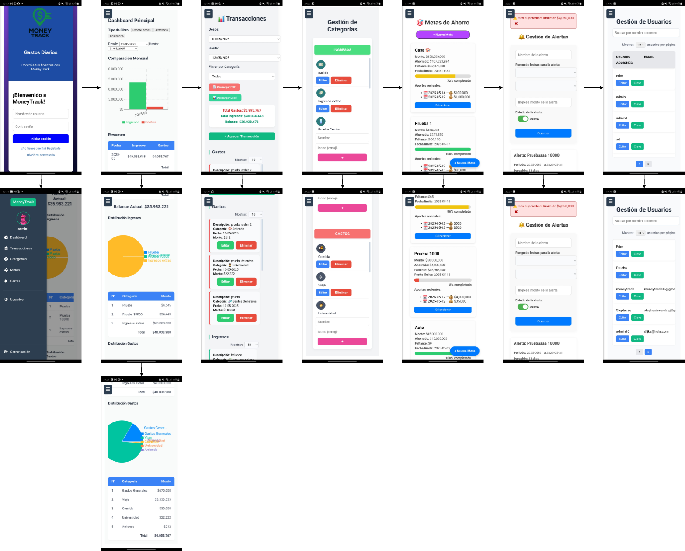

# 💰 MoneyTrack

**MoneyTrack** 
es una aplicación web y móvil para gestionar ingresos, egresos, metas de ahorro y alertas personalizadas.
Pensada para el control financiero personal, está desarrollada con React en el frontend y Django REST Framework en el backend.

---

## 🚀 Funcionalidades principales

1. Registro y login con token
2. Dashboard con gráficos dinámicos

   * Gráfico de barras: ingresos vs. gastos por mes
   * Gráfico de torta: distribución por categoría
   * Balance automático
3. Registro, edición y eliminación de transacciones
4. Gestión de categorías de ingreso/gasto
5. Metas de ahorro con seguimiento visual y aportes
6. Alertas por límite de gasto (con notificaciones)
7. Interfaz 100% responsiva
8. Panel exclusivo para `admin1` con gestión de usuarios

---

## 🛠️ Tecnologías utilizadas

* **Frontend:** React, HTML, CSS
* **Backend:** Django, Django REST Framework
* **Base de datos:** SQLite
* **Gráficas:** Recharts
* **Autenticación:** Token (DRF)
* **Exportación de datos:** jsPDF, SheetJS (xlsx)
* **Correo:** Servidor SMTP configurado para recuperación de contraseñas en tiempo real *(revisar carpeta de spam)*

---

## 🧪 Clonar y ejecutar el proyecto

```bash
git clone https://github.com/anerca90/MoneyTrack.git
cd MoneyTrack
```

---

## ⚙️ 1. Configurar el Backend

```bash
cd backend_moneytrack
python -m venv venv

# Activar entorno virtual:
# En Linux/macOS:
source venv/bin/activate
# En Windows:
venv\Scripts\activate

pip install -r requirements.txt
python manage.py migrate
python manage.py runserver 0.0.0.0:8000
```

---

## 💻 2. Configurar el Frontend

```bash
cd frontend_moneytrack
npm install
npm start
```

> Accede a la app en: `http://localhost:3000`

---

## 👤 Usuario administrador

```
Usuario:    admin1
Contraseña: admin
```

---

## 🔐 Login de prueba

### 🧪 Opción 1: vía Postman

* **URL:** [http://192.168.1.90:8000/api/login/](http://192.168.1.90:8000/api/login/)
* **Método:** POST
* **Cuerpo JSON:**

```json
{
  "username": "admin1",
  "password": "admin"
}
```

### 🌐 Opción 2: vía Web

* **URL:** [http://192.168.1.90:3000](http://192.168.1.90:3000)
* **Método:** Web
* **Credenciales:** admin1 / admin

---

## 📱 Versión móvil

La app móvil puede conectarse por IP local al backend. Asegúrate de:

1. Que ambos dispositivos estén en la misma red Wi-Fi.
2. Ejecutar Django con `0.0.0.0:8000`.
3. Reemplazar `localhost` por tu IP en las llamadas `fetch` o `axios`.

---

## 🖼️ Capturas de pantalla

### 🧭 Menú lateral

Vista del panel de navegación con acceso a las secciones:



---

## 📊 Funcionalidades implementadas

* ✅ Login y registro
* ✅ Dashboard con gráficos
* ✅ Transacciones con filtros por fecha
* ✅ Gestión de categorías
* ✅ Metas de ahorro
* ✅ Exportación a PDF/Excel
* ✅ Módulo de alertas
* ✅ Versión APK móvil
* ✅ Panel de usuarios (solo `admin1`)
* ✅ Envío de correos para recuperación de contraseña en tiempo real
* ✅ Todos los módulos funcionales y operativos

---

## 👨‍💻 Autores

* Álvaro Santis Catalán
* David Romero Vallejos
* Yazmin Améstica Aránguiz
* Yubram Barraza Pérez
* Erick Espínola Landaeta

---

## 📄 Licencia

Este proyecto fue desarrollado como parte del curso universitario de Ingeniería en Computación e Informática (UNAB, 2025). 
Destinado exclusivamente para fines educativos.
